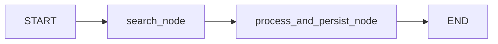
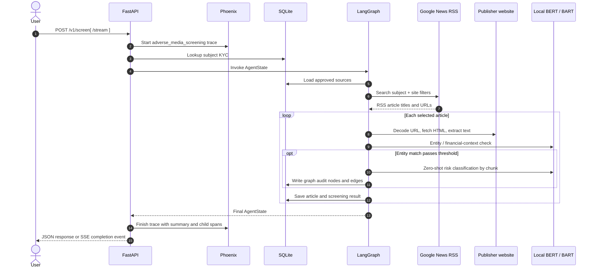

# Adverse Media Scanner

## High-Level Design

> **Document status:** Current implementation  
> **Runtime shape:** Local Python services, SQLite, local Transformer inference, and Phoenix tracing  
> **Web UI:** None; operators use the FastAPI OpenAPI page or the command-line workflow

---

## 1. Executive Summary

The Adverse Media Scanner screens a customer or subject against public news. It searches Google News RSS using region-approved publishers, decodes and fetches candidate articles, extracts article text, checks identity and financial context against a local KYC profile, classifies risk with local BERT/BART models, and writes the screening and audit results to SQLite.

FastAPI is the service boundary. LangGraph sequences the search and processing nodes. Phoenix receives OpenTelemetry spans for the run and its individual stages. The database and model inference are local; Google News and publisher websites are external dependencies.

```mermaid
flowchart LR
    analyst[Analyst / API client] -->|REST or SSE| api[FastAPI service]
    operator[CLI operator] -->|Python call| graph[LangGraph workflow]
    api --> context[KYC context lookup]
    api --> graph
    graph --> search[News search]
    search -->|RSS request| google[Google News]
    graph -->|decode, fetch, extract| publishers[Publisher websites]
    graph --> entity[Entity resolution]
    graph --> risk[Risk classification]
    entity --> ner[Local BERT NER]
    risk --> bart[Local BART zero-shot classifier]
    context --> sqlite[(SQLite: aml_scanner.db)]
    graph --> sqlite
    api -. spans .-> phoenix[Phoenix collector / UI]
    graph -. spans .-> phoenix
```

## 2. System Context

| Boundary | Responsibility | Examples |
|---|---|---|
| Client | Starts a scan, previews search, reads history/config | Swagger UI, CLI, future client |
| API | Validates requests, looks up KYC, invokes the graph, returns results | FastAPI on `127.0.0.1:8000` |
| Workflow | Orders search, scrape, entity resolution, risk classification, and persistence | LangGraph `StateGraph` |
| External data | Supplies news links and article pages | Google News RSS, publisher websites |
| Local inference | Extracts person entities and classifies risk | `dslim/bert-base-NER`, `facebook/bart-large-mnli` |
| Persistence | Stores customer, article, decision, and knowledge-graph audit records | SQLite `aml_scanner.db` |
| Observability | Stores trace/span trees and run metadata | Phoenix UI `localhost:6006`, OTLP gRPC `localhost:4317` |

The API starts on loopback by default. Phoenix should also be bound to loopback (`PHOENIX_HOST=127.0.0.1`) because traces contain sensitive screening data.

## 3. Runtime Components

### FastAPI

`api.py` initializes database tables and compiles the graph during module import. Its routes are:

| Route | Behavior |
|---|---|
| `GET /health` | Liveness response |
| `GET /v1/observability` | Phoenix instrumentation and collector reachability |
| `POST /v1/preview-search` | Search preview; no article analysis or persistence |
| `POST /v1/screen` | Synchronous full scan; returns one JSON response |
| `POST /v1/screen/stream` | Full scan with Server-Sent Event progress and a final result |
| `GET /v1/screenings/{target_id}` | Historical screening records |
| `GET /v1/configs` | Read system configuration |
| `PUT /v1/configs` | Update a configuration value |

### Command-line workflow

`main.py` runs the same graph directly. Its current script entry point uses a predefined subject and region, previews news, prompts for a fetch limit, and prints the results. It does not add the API route's root scan span, though workflow stage spans are still available when Phoenix instrumentation is active.

### LangGraph

`graph/workflow.py` builds a two-node directed graph:



`AgentState` is the shared workflow payload. `emit_progress` sends optional events to the SSE endpoint through a callback in LangGraph's configurable state.

### Local models

`tools/analyzer.py` loads two Hugging Face pipelines at import time:

- NER: `dslim/bert-base-NER`, used when the subject name is not an exact substring of article text.
- Zero-shot risk classification: `facebook/bart-large-mnli`, used only after entity resolution confirms a match.

The models run locally on the available device (CPU or supported accelerator). No model-provider API is called for these two steps.

## 4. End-to-End Request Sequence



## 5. Workflow Stages and Data

### 5.1 Subject preparation

`load_subject_context(identifier)` queries `customer_kyc` by exact `full_name` or `customer_id`. It returns:

- `kyc`: a dictionary containing customer ID, name, city, profession, and associated companies; `{}` when no row matches.
- `kyc_context`: the city/company string passed to the graph, or a fallback message.

Phoenix records the identifier, the profile, location presence, and company count. This is sensitive personal data.

### 5.2 Source discovery

`search_node(state, config)` reads `region` and `fetch_limit`, looks up `region_configs.allowed_sources`, and calls `get_adverse_news`.

`fetch_google_news_metadata(target_name, region_name)`:

1. Loads the approved source names from SQLite.
2. Converts publisher names to domain filters with `extract_domain`.
3. Builds a quoted-name query, adding `site:` filters where available.
4. URL-encodes the query and sends a `GET` to Google News RSS with a 10-second timeout.
5. Parses RSS `<item>` titles and links into `articles`.

`get_adverse_news` limits the returned list to `max_results`. Phoenix captures the exact query, region, allowed sources, RSS URL/body, parsed articles, and selected articles.

### 5.3 Article extraction

For each selected article, `scrape_article(google_news_url)`:

1. Calls `gnewsdecoder` and falls back to the original URL if decoding fails.
2. Calls `trafilatura.fetch_url` for publisher HTML.
3. Calls `trafilatura.extract` for readable article text.
4. Returns `url`, `text`, and `error`.

If text is empty or shorter than `min_content_length` (default `150`), the article is skipped for entity, risk, and persistence stages. The scrape spans capture the Google URL, decoded publisher URL, raw HTML, extracted text, lengths, outcome, and errors.

### 5.4 Entity resolution

`resolve_entity_with_weights(target_name, kyc_profile, article_text)` first checks for financial-context keywords. If financial context exists:

- Exact subject substring match: name score `0.50`.
- Otherwise NER checks at most the first 1,500 characters; a matching person entity scores `0.30`.
- Matching KYC city: location score `0.25`.
- One or more associated companies found: association score `0.25`.

The total is `name + location + association`. A confirmed match requires `name_score > 0` and `total_confidence >= 0.40`. The returned object includes match status, total confidence, reasoning, factor scores, financial-context status, association count, whether NER ran, and extracted names.

### 5.5 Risk classification

`classify_risk(article_text)` reads these settings:

| Setting | Default | Use |
|---|---:|---|
| `risk_labels` | Financial Fraud, Money Laundering, Arrest or Extradition, Legal Penalty or Court Order, Normal Business News | Zero-shot candidate labels |
| `risk_fallback_keywords` | fraud, scam, money laundering, cbi, ed raid, court, penalty | Optional fallback adjustment |
| `chunk_size` | `1000` | Characters per classification chunk |
| `max_text_scan_limit` | `4000` | Maximum article characters classified |

BART scores each chunk against the candidate labels. If it selects `Normal Business News` while a fallback keyword is present, the workflow changes the category to `Financial Fraud / Penalty` and boosts the best non-normal score, capped at `0.98`. Each chunk span contains the text, labels, raw scores, character offsets, selected label/score, and fallback decision.

### 5.6 Persistence and final result

The processing node creates one `targets` row per scan. For each sufficiently long article it writes `scraped_news` and `screening_results`. Confirmed matches also write knowledge-graph nodes/edges through `log_graph_audit`.

The API response contains `scan_id`, `trace_id`, target ID/name, KYC profile, region, effective article limit, article count, confirmed-match count, and article results. Each article result contains title, URL, match/risk scores, risk category, and reasoning.

## 6. Data Contracts

### LangGraph `AgentState`

| Key | Type | Meaning |
|---|---|---|
| `target_id` | `int` | Set to the inserted target row ID during processing |
| `target_name` | `str` | Requested customer identifier |
| `target_context` | `str` | KYC-derived context for resolution |
| `region` | `str` | Jurisdiction used for allowed publisher lookup |
| `fetch_limit` | `int` | Maximum article links selected for processing |
| `search_results` | `List[Dict[str, str]]` | Search article metadata (`title`, `url`) |
| `current_article` | `Dict[str, str]` | Reserved/initialized empty; currently unused |
| `analyzed_results` | `List[Dict[str, Any]]` | Per-article final decisions |
| `errors` | `List[str]` | Reserved/initialized empty; current nodes do not append to it |

### SQLite tables

| Table | Contents |
|---|---|
| `customer_kyc` | Customer ID, full name, DOB, city, profession, associated companies |
| `region_configs` | Region-to-publisher source list |
| `system_configs` | Key/value settings and descriptions |
| `targets` | One scan target and context per graph run |
| `scraped_news` | Target-linked article URL, title, and extracted content |
| `screening_results` | Match decision, risk confidence/category, reasoning |
| `graph_nodes` | Target, article, and risk-category nodes |
| `graph_edges` | Relationships such as `MENTIONED_IN` and `TRIGGERED_RISK` |

`DB_PATH` resolves to `aml_scanner.db` beside `database.py`, so launch directory does not choose a different database.

## 7. Phoenix Observability

`observability.py` registers project `adverse-media-scanner` and provides `traced_span` and `mark_span_error`. Phoenix spans are marked `OK` on success and `ERROR` on exceptions or explicit failure handling.

The trace tree includes model initialization, scan root, KYC lookup, source loading, Google RSS request, result selection, target creation, URL decoding, article fetch/extraction, NER, entity resolution, each risk chunk, knowledge-graph audit, and article persistence. The root span includes request and final result payloads. Full trace data includes subject/KYC values, exact search terms, RSS content, URLs, raw HTML, article text, and model inputs/outputs.

Phoenix runs locally at `http://localhost:6006` and stores data in `~/.phoenix/phoenix.db` by default. Bind it to `127.0.0.1`; treat its database as sensitive. Local BERT/BART inference does not produce external LLM token or API-cost metrics.

## 8. Deployment and Operational Model

- No Docker/Podman requirement, container orchestration, Prometheus scraper, or web frontend is part of the current application.
- Run Phoenix and the API as two local processes using the same Python virtual environment.
- The API binds to `127.0.0.1:8000` when started through `python api.py`.
- The first start may download model weights. Google News and publisher fetching require outbound internet access.
- `/metrics` returning `404` is expected; stop any stale Prometheus container that still polls it.
- Keep Phoenix bound to loopback because traces contain personal and article data.

## 9. Known Implementation Notes

- `required_articles`, `initial_search_fetch`, and `search_keywords` are seeded in `system_configs` but do not currently control the graph path.
- `search_node` loads approved sources, then `get_adverse_news` currently loads sources again; its `allowed_sources` parameter is accepted but not used.
- The synchronous scan executes with an effective fallback limit of 5 when `fetch_limit` is null, but `fetch_limit_applied` currently returns the original request value.
- `main.py` uses a predefined target/region; edit its script constants to change the CLI subject.
